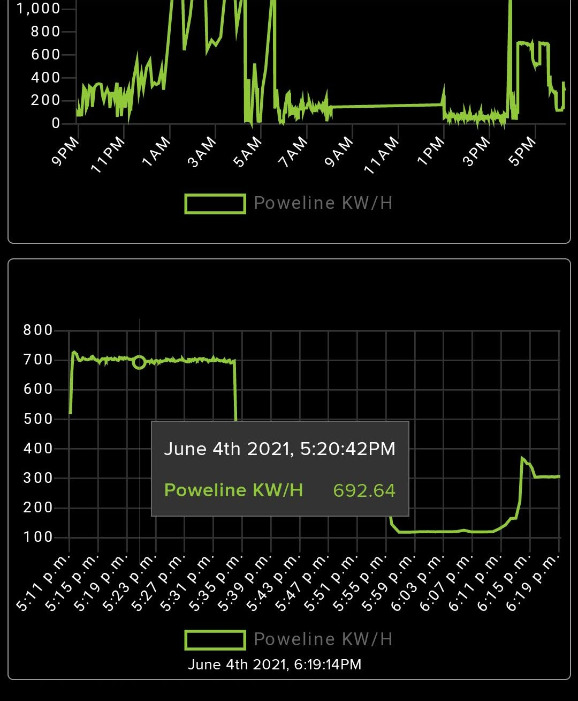
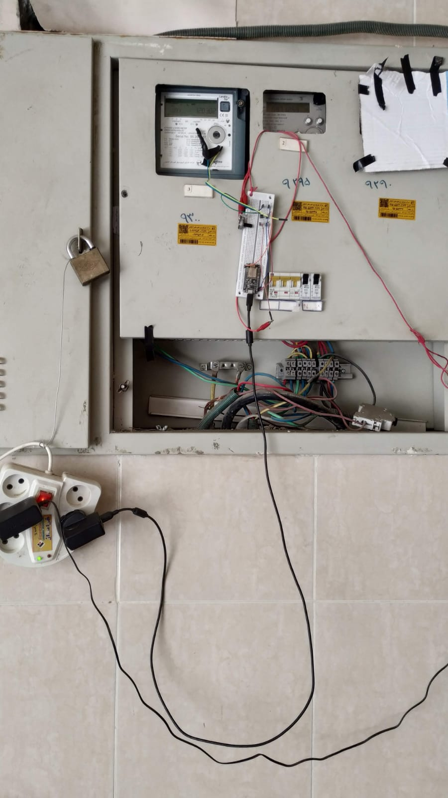

# Power line Monitor

# Mobile view dashboard:

# Crude POC

# Related links
[Related Links](Assets/RelatedLinks.html)

Init vscode config
pio init --ide=vscode

Access to usb 
sudo chmod 666 /dev/ttys0
https://askubuntu.com/questions/210177/serial-port-terminal-cannot-open-dev-ttys0-permission-denied
